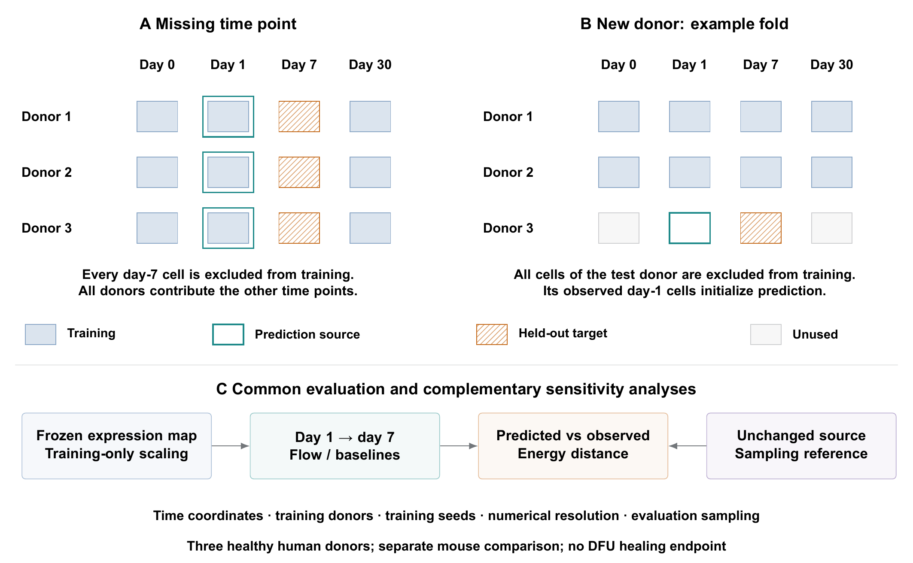

# Held-out wound single-cell population dynamics

Author: Zeyu Fu. Software version: 0.2.0.

The manuscript and figures were revised on 21 September 2026. See [MANUSCRIPT_REVISION.md](MANUSCRIPT_REVISION.md) for the editorial changes and verification. The software DOI identifies the independently archived analysis version.

Software for reconstructing a held-out acute human wound distribution and evaluating transfer to held-out donors. The study compares time coordinates, neural and non-neural predictors, training-donor counts, training seeds, mouse model arms, numerical integration and evaluation sampling. Three human donors provide biological replication; the study does not establish diabetic-foot-ulcer prognosis.

The acute human time course contains three donors. The mouse comparison has one animal per arm and time point. Numerical resolutions, seeds and evaluation draws do not increase the donor count. Bootstrap draws and cells are not additional independent patients.

This study has its own [GitHub repository](https://github.com/PeterPonyu/wound-population-dynamics), version history, citation metadata and Zenodo deposit metadata. It does not import code or results from another study repository. Its GitHub release and Zenodo deposition are managed independently; no GitHub–Zenodo integration is required.

Read the [manuscript](output/pdf/wound_population_dynamics.pdf) and the [figure collection](manuscripts/figures/figures.pdf). The package contains 6 editable R/TikZ vector figures, numerical tables, completed reports, and its own copy of the frozen expression model. RESULTS_INDEX.json maps numerical reports to manuscript use. A copy of the model is included here so the project runs independently.



## Rebuild from saved numerical inputs

```sh
python3 verify_archive.py --smoke
python3 manuscripts/latex/export_tables.py
python3 manuscripts/build_main_figures.py
python3 manuscripts/latex/build.py --render
python3 scripts/assess_robustness.py --output-dir outputs/reruns/robustness
python3 -m unittest discover -s tests -v
```

The figure and PDF commands require R with ggplot2, tikzDevice, jsonlite and digest; XeLaTeX/BibTeX/latexmk; Poppler; and installed Arial and TeX Gyre fonts. Fonts are not redistributed. Python package versions are recorded in requirements.txt and environment.json. CPU execution is supported; recorded neural fits used CUDA. The robustness command fits one seed-0 field and recomputes integration and evaluation-sampling sensitivity from the saved inputs, without raw-count downloads.

## Rights

The MIT License applies to software, including analysis and rendering programs. Manuscripts, figures, tables, saved models, numerical results and source-study data retain their respective rights as set out in NOTICE. The full reproduction ZIP and the software-only Zenodo ZIP are different artifacts with separate manifests and checksums.

## Citation and independent archiving

Use CITATION.cff for software attribution. ARCHIVING.md describes direct Zenodo deposition using this study's .zenodo.json and software-only ZIP. A reserved identifier is not a published DOI; only verified published records are added to citations. Each study has its own deposit state, preventing accidental reuse of the other study's record.

The independently published software archive for version 0.2.0 is [available on Zenodo](https://doi.org/10.5281/zenodo.22875664). Previous versions remain available for attribution.

## Mathematical verification

Version 0.2.0 corrects method descriptions and adds explicit estimands, analytic unit tests and a frozen-input sensitivity report. Read METHODS_CONTRACT.md and CHANGELOG.md for the interpretation and provenance boundaries. Recompute the added analysis with `python3 scripts/audit_population_math.py --output-dir outputs/reruns/mathematical_audit`. This uses saved inputs and does not refit the original representation or temporal fields.
